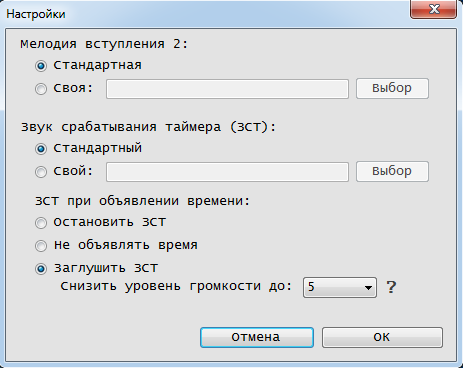

# Диктор времени
Эта программа была создана для озвучивания времени с возможностью настройки интервала озвучки, а также времени начала и окончания периода озвучки времени.
Позже программа была дополнена таймером и настройками.

## Установка
Данной программе не требуется какое-то особое расположение - она может быть установлена куда угодно, НО должна иметь возможность записи файлов в папке, в которой находится.
Ярлык на автозапуск программа НЕ создаёт.

Хоть установщик не является необходимым, для более удобной установки он всё же прилагается в разделе **Releases**.

## Использование
После установки программу можно запустить. После запуска будет показано основное окно, а в трее появится значок диктора времени, к которому нужно обратиться, если нужно завершить работу диктора времени, либо открыть какое-то окно после закрытия всех окон. Как можно понять из вышесказанного, работа программы НЕ завершается после закрытия всех окон. Для завершения работы программы нужно обратиться к её иконке в трее (кликнуть правой кнопкой мыши и в появившемся меню выбрать пункт "Выход").

На изображении ниже показано основное окно программы:

Интрефейс программы можно считать интуитивно понятным. Важно: во всех окнах есть всплывающие подсказки, так что для получения информации можно навести курсов на интересующий элемент и немного подождать. Кнопка "Активировать"/"Деактивировать" является своего рода рубильником, поэтому надпись "Активировать" означает, что все функции программы остановлены (в том числе и таймер), т.е. не активированы. Для активации нужно просто нажать на кнопку :-)

На изображении ниже показано окно управления таймерами:

Знак "внимание" в этом окне означает, что программа не активирована, следовательно, таймеры не ведут отсчёт.
Если нужно запустить таймеры без дикции, то можно настроить период озвучитвания так, чтобы он не был кратен отрезкам озвучки. Например, настроить озвучку на "каждые 5 часов", а период озвучки задать с 00:01 до 00:02. В этом случае диктор будет молчать всегда.

Далее рассмотрим ещё одно окно:

Это окно настроек. "Вступление 2" - это проигрыш перед звуком таймера. "Вступление 1" - это проигрыш перед озвучкой времени.

Имеет смысл сказать, что программа для воспроизведения звука использует библиотеку windows media, поэтому может воспроизводить всё, что может воспроизвести стандартный проигрыватель (только звук).
